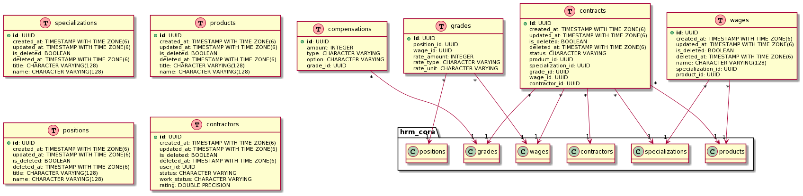

# HRM-core

Задача сервиса - управление профилем исполнителя и закрепление за ним определённого тарифа.
 

- [Техрешене](https://qleanru.atlassian.net/wiki/spaces/DOCS/pages/1923809281/beta-1+HRM+Core)

## Сущности

...

### Генерация файла с миграцией
Чтобы сгенерировать миграции нужно выполнить
npm run typeorm migration:generate -- -n init
Настройки .env:
TYPEORM_ENTITIES = "src/**/*.entity.ts"
TYPEORM_MIGRATIONS = "src/infrastructure/migration/*.ts"
TYPEORM_MIGRATIONS_DIR = "src/infrastructure/migration"

### Запуск миграции
Чтобы сгенерировать миграции нужно выполнить команду:

npm run typeorm migration:run

Настройки .env:
TYPEORM_ENTITIES = "src/**/*.entity.ts"
TYPEORM_MIGRATIONS = "src/infrastructure/migration/*.ts"
TYPEORM_MIGRATIONS_DIR = "src/infrastructure/migration"
